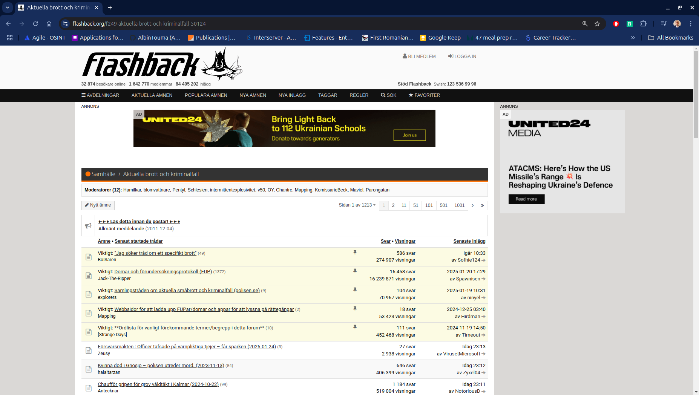

# Signal Sifter

Sweden faces a growing crime epidemic, but public access to detailed crime data remains limited despite extensive media coverage, particularly of gang violence. This project seeks to address this gap by using alternative data sources to map crimes and their locations.

One of the key resources explored is Flashback Forum, a popular Swedish platform where users discuss crime, share media links, and analyze court cases. 

These discussions offer raw, unfiltered insights into incidents, potentially revealing patterns and connections not easily accessible through traditional sources.

## Method

Flashback is similar to forums like 4Chan. The site has boards that contain threads. Each thread is a discussion on a topic and contains posts and replies.
In the future the crawler will collect entities, events, and links from posts and replies on each thread.

## Crime Data

Crime related data:

- Crime
- Location(s) mentioned
- Date(s) mentioned

Metadata:

- Public interest in crime (replies/views)
- Sentiment analysis

## Roadmap

So far the project has crawled one board and collected metadata on 66,000 threads posted between 2007-2005. 
- Rank threads by probability of crime related data based on thread title.
- Collect crime data from posts and replies on threads.
- Analyse sources present in threads.
- Geolocate and map incidents
